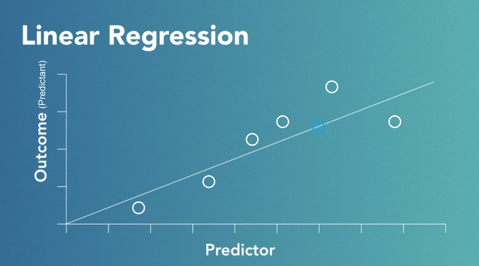
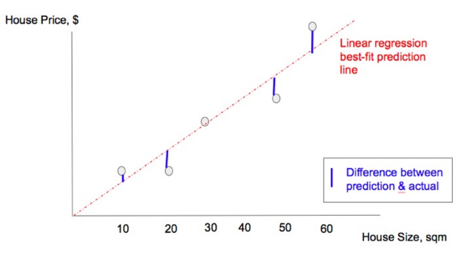
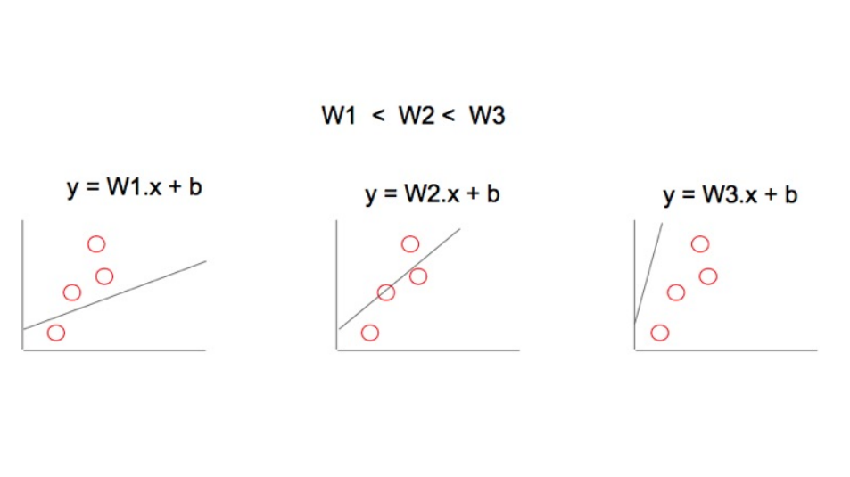

# FH Wedel - Lecture notes

* Explorative Data Analysis: Teilgebiet der Statistik, untersucht & begutachtet Daten von denen nur ein gerringerres Wissen über deren Zusammenhänge vorliegt.
    * confirm / validate the data
    * discover correleations
    * spot anomalies (e.g. outliners)
    * frame hypothesis
    * check assumptions
    * prepare data 
    * visual explorations of the data
* substantive expertise
    * ability to ask good questions it requires domain knowledge (= Wissensgebiet)
* Data science is the intersection of hacking skills, math and statistics knowledge and substantive experience
    * answering questions with data for better action decisions

## Machine Learning - Intro
* Paradigm shift between traditional programming and machine learning: 
    * TP: Takes in Data and so called rules to determine the computation for the answers
    * ML: Takes in Data and Answers for predifined problems and computes the answers using a model
* Quite popular nowadays because of the stagnating storage, cpu and bandwidth costs
* Supervised vs. unsupervised learning
    * Supervised: Data needs to be labeled, training data contains both 
        * the input and the desired result (target)
        * construction of disting training- / dev- / testset of the data is critical
        * Supervised methods usually fast and accurate
        * Aim is generalization: predict the correct results with new, unseen data
    * Unsupervised: Data doesn't need to be labeled
        * Used for exploratory analysis (exploratory = untersuchend / Forschungs- / erforschend)
        * Aim is to find unknown underlying intrinisic structures (intrinsic = innewohnend / innere) of data (clusters)
    * Mixed machine learning types
        * semi-supervised: e.g. not all labels are known
        * reinforced: learning from consequences of action and reward

## Common ML techniques: 
* Regression analysis: How much / many?
* Classification: Is this A or B?
* Cluster analysis: Where does it belong to?
* Anomaly detection: is this weird?
* Recommender systems What's the next best thing?
* NLP / Text Mining: What does it mean?
* Association analysis: What goes with this?

### Linear regression

* Example: How much / many would a user spend on e.g. candy crush
* Popular algorithms: 
    * Linear regression
    * Polynomial regression
    * Ridge Regression
    * LASSO
    * Elastic Net
* Can be expressed with a linear function _y = f(x)_
* is a statistical ML method
* you can quantify and make forecasts (predictions) based on relationships between numerical variables
* **simple linear regression**: one predictor and one outcome (predicant)
* **multiple linear regression**: multiple predictors and one outcome (predicant)

### Hypothsis function

