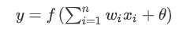
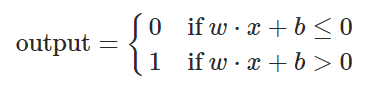

# Geschichtliches
Leitfrage: Welche Entwicklungen hat das Neuronale Netz von damals zu heute durchgemacht?

> [Quelle](https://medium.com/analytics-vidhya/brief-history-of-neural-networks-44c2bf72eec)

## McCulloch-Pitts-Neuron
> [towardsdatascience.com - link](https://towardsdatascience.com/mcculloch-pitts-model-5fdf65ac5dd1)

* 1943 - Warren McCulloch (Neurowissenschaftler) & Walter Pitts
* Erstes Modell realer Vorgänge in neuronalen Strukturen
* Modell kann beliebig viele Inputwerte aufweisen
    * Werte sind boolescher Natur (nur wahr oder falsch / 1 vs. 0)
* Neuron besteht aus zwei Teilen
    * 1. Eingabewerte werden zusammengefasst / aufaddiert
    * 2. Es wird geschaut ob das Ergebnis einen größeren Wert als Theta ausweist
        * Theta: 0 mit horizontalem Strich durch die Mitte
        * beliebige Zahl, siehe Beispiele

* Nachteile des Modells
    * Nur boolesche Eingabewerte / Ausgabewert möglich
    * Schwelle (Theta) stets manuel bestimmen
        * Es gibt keine "fertigen" Operationen
    * Keine Gewichte für einzelne Eingabewerte
        * Alle Werte haben gleiche Priorität
    * Nicht möglich "gedeckelte" logische Funktionen abzubilden
        * Xor mit Obergrenze, max einer von beiden Inputs true

## The Organization of Behavior
> [Quelle 1 - Abs. 2](https://www.ncbi.nlm.nih.gov/pmc/articles/PMC4006178/)

> [Quelle 2](https://flexikon.doccheck.com/de/Hebb%27sche_Lernregel)

* 1949 - Donald Hebb
    * Buch: The Organization of Behavior
    * "gilt als Entdecker der _synaptischen Plastizität_, welche die neurophysiologische Grundlage von Lernen und Gedächtnis darstellt."
    * **synaptische Plastizität**: beschreibt grob den Umbau neuronaler Strukturen in Abhängigkeit ihrer Verwendung
        * Kann ganze Hiernareale betreffen
* todo: in roten Kasten -> Hebbsche Lernregel: _„Wenn ein Axon der Zelle A […] Zelle B erregt und wiederholt und dauerhaft zur Erzeugung von Aktionspotentialen in Zelle B beiträgt, so resultiert dies in Wachstumsprozessen oder metabolischen Veränderungen in einer oder in beiden Zellen, die bewirken, dass die Effizienz von Zelle A in Bezug auf die Erzeugung eines Aktionspotentials in B größer wird."_
* Berühmte Satz von Carla Shatz (auf Grundlage von Hebb)
    * _**Neurons that fire together, wire together.**_
* "Je häufiger ein Neuron A gleichzeitig mit einem Neuron B aktiv ist, also Aktionspotentiale erzeugt, desto eher werden die beiden Neuronen miteinander agieren."
    * Hervorzuheben ist, dass eine einmalige oder mehrmaliges gemeinsames agieren über einen längeren Zeitraum wenig / gar nichts bewirkt.

## IBM erste Simulation eines NN
// todo Teil kann vielleicht einfach ausgelassen werden???
* 1950er - Nathanial Rochester (IBM)
* erste Erfolge
* Wenig Informationen -> TODO

## Dartmouth Konferenz
// todo Teil kann vielleicht einfach ausgelassen werden???
> [Quelle - Leidre nur Wikipedia](https://de.wikipedia.org/wiki/Dartmouth_Conference)

* 1956 - John McCarthy, Marvin Minsky, Nathanial Rochester, Claude Shannon (geplant / ausgeführt)
* Forschungsprojekt / Konferenz gilt als Geburtsstunde der KI als akademisches Fachgebiet
* Unterthemen der Konferenz
    * 1. Automatische Computer
    * 2. Wie muss ein Computer programmiert werden, um eine Sprache zu verstehen
    * 3. Neuronale Netzwerke
    * 4. Theoretische Überlegungen zum Umfang einer Rechenopertion
    * 5. Selbst-Verbesserung
    * 6. Abstraktion
    * 7. Zufälligkeit & Kreativität
* Teilnehmer sollten Gedanken zu den Themen verschriftlichen und mit anderen Austauschen
* Anschließend wurden Ergebnisse besprochen

## Von Neumann
> [Quelle](https://www.leydesdorff.net/vonneumann/)

* 1957 - Von Neumann (Letztes Werk)
* Paper: Vergleich des Aufbaus des Gehirns mit einem Rechner / Computer
* Manuskript in zwei Teile unterteilt
    * 1. Computer: Prozeduren, Kontrollmechanismen, sonstige Charakteristika
    * 2. Neuronales System: von Neumann vergleicht damalige state-of-the-art Rechner mit der neuen Technologie.
* Neumann beschreibt die Idee simple Neuronen mittels Telegraphrelais / Vakuum-Rohren oder Transistoren zu modellieren
* Menschliche Neuronen brauchen immer eine kleine "Erholungsphase" bis sie wieder in der Lage sind aktiv zu werden
    * Die genannten Bauteile brauchen einen wesentliche kürzeren Zeitraum
    * Von Neumann hat damals schon das Potenzial für / von Künsliche Intelligenz erkannt
        * Vergleich zwischen Rechner und Gehirn schon damals ein valides Unterfangen

## Perceptron
> [Quelle](https://www.sciencedirect.com/topics/veterinary-science-and-veterinary-medicine/perceptron)

* 1958 - Frank Rosenblatt erfindet Perceptron
* Perceptron: ältestes Neuronales Netz welches heutzutage noch genutzt wird
* Inspiriert vom Auge einer Fliege
    * Ein großer Teil der Entscheidung der nächsten Flugrichtung wird direkt im Auge entschieden
    * Perceptron direktes Abbild dieser Beobachtung
* Überwachtes Lernen
* Ein Peceptron mit nur einer Schicht
* Berechnet eine gewichtete Summe aller Eingaben und addiert einen Schwellwert
* im letzten Schritt wird eine Aktivierungsfunktion an diese Pipeline angehängt
    * In der Lage Eingabe in zwei mögliche Ausgabeklassen zu unterscheiden
    * zu Rosenblatts Zeiten sehr simpel,
        * wenn Ergebnis kleiner gleich 0 -> Output 0
        * ansonsten -> Output 1
    * Generell gilt, je größer der Schwellwert ist, desto "leichter" kann ein Neuron aktiviert werden 
    * Heutzutage werden verschiedene Aktivierungsfunktionen genutzt
        * Immer abhängig vom jeweiligen Problem welches es zu lösen gilt

* Rosenblatts' Lernregel
    * 1. Initialisiere alle Gewichte mit 0 oder einer sehr kleinen Zahl
    * 2. Für jede Trainingsprobe (training sample) X^(i)
        * 1. Berechne den output Wert
        * 2. Aktualisiere die Gewichte 

## Adeline
* Bernard Widrow & Tedd Hoff
* Adaptive Linear Neuron => Adeline
* Delta Regel (auch Widrow-Hoff-Regel genannt)
    * aktualisiert Gewichte anhand von einer linearen Aktivierungsfunktion
        * nicht mittels einer springenden Stufenfunktion wie beim Perceptron

* 

// deeplearning book, a simple network to classify handwritten digits

