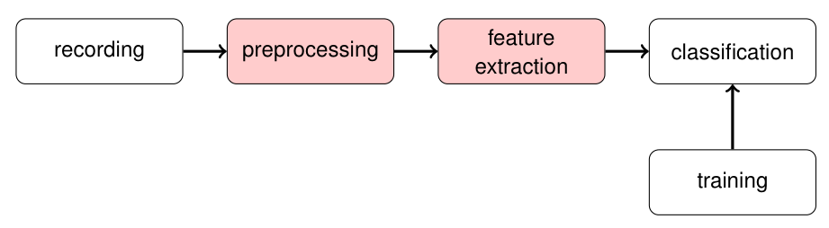
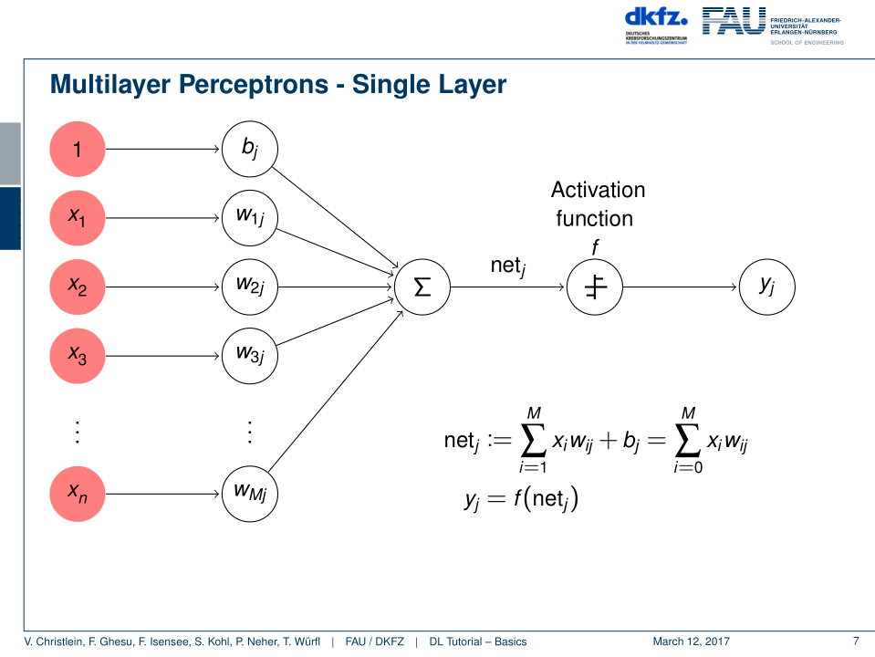
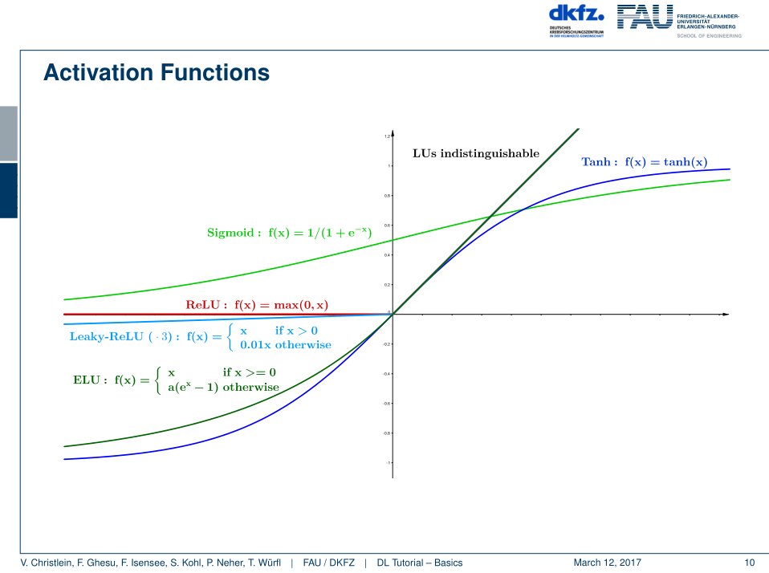
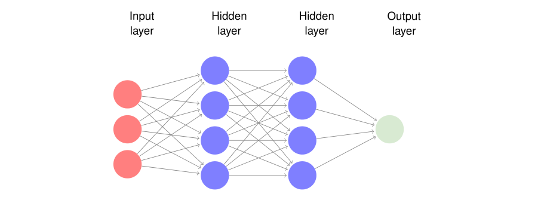
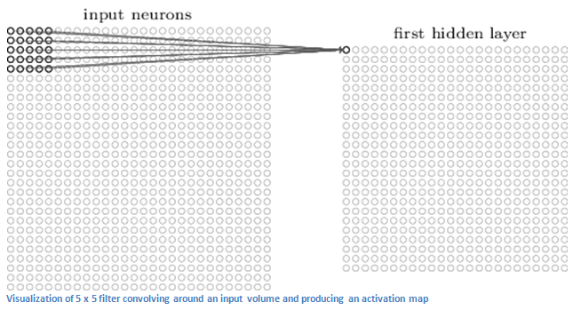
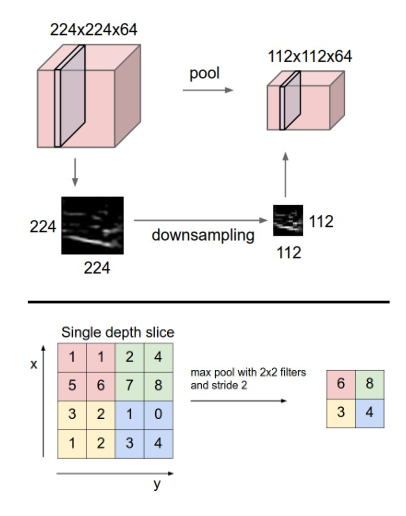
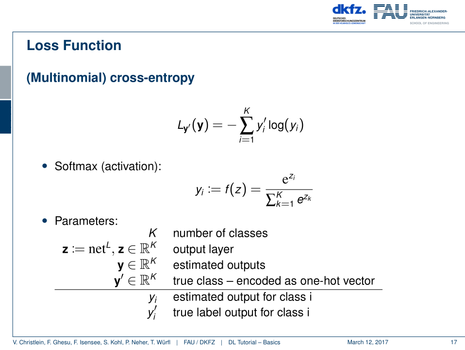

# Deep Learning Tutorial - FAU

## Intro

* Feature engineering
    * tedious prerequsite for effective learning
    * fundamental part of the pipeline
    * ml algorithms don't always work so well on raw data
    * extract features from the data to make the behaviour of the system more obvious to the ml algorithm
    * starts with your _best guess_ of about what features may influence the thing your trying to predict 
        * iterativ process: adding new features and see if result improves 
    * E.g. predict if flight may be delayed
        * raw data: e.g. month of the flight, destination, day of the week
        * when adding a feature containing the _flights per day_ this may improve the prediction by a significant amount
    * E.g. check if a raw audio signal of a heart sound _healthy_ or not.
        * extract the most important features to make it more obvious for the nn 
    * Machine learning vs. deep learning
        * dl approaches require less manual feature engineering instead the features are learned as part of the training process
        * while this has often shown very promissing results dl models require more data, take longer to train and the resulting model is typically less interpretable than if you were to manual engineer the features.

## Multilayer Perceptors
* Analogy to brains exist in some form -> dissect features from high to low level features 
* Multilayer perceptors topology assemble from the input, hidden and the output layer
* Network architecture: 
    * number of input units: dimensions of features
    * number of output units: typically number of classes
    * number of hidden units: design issue (underfitting, overfitting)
* The output of a single node from a layer of a multilayer perceptor topology consists out of ...
    * weights 
    * output values from the previous layer
    * activation function
    * bias 

### Fully-Connected Layer

* fully pairwise connections
* expensive to train 
    * Example: 200 x 200 x 3 image -> 120,000 weights in each neuron of the first hidden layer
* Ignore spatial (= räumlich) structure of images 
* still often used as last layer 
    * more common nowadays: average pooling

### Convolutional Layer
// insert link
* The first layer in a Convolutional Neural Network (CNN)
* Example of an image recognition 
    * 32 by 32 pixels with the RGB colors -> 32 x 32 x 3 array containing values from 0 to 255

* Those highlighted input neurons form a so called _receptive field_
* A filter / neuron / kernel takes in the inputs from the receptive field
    * sums up the product of the weights with each value 
* Filter moves around the the image and each possible "spot" for the 5 x 5 connected input neurons
* Resulting 28 x 28 x 1 array is called _activation_ or _feature_ map
    * you get 28 x28 array because there 784 different locations that a 5 x 5 filter can tif on a 32 x 32 input image
* different kinds possible for the actual pooling process 
    * max pooling
    * fractuional max pooling
    * mean pooling
    * Lp pooling
    * stoachastic pooling
    * spatial pooling
    * generalized pooling
* Trend: Instead of pooling use convolution with stride 2

### Backpropagation
* 1. Forward pass: compute network's output
* 2. Evaluate loss
* 3. Backward pass: adjust weights

// p. 57 -> no idea if really relevant

