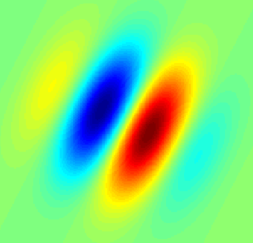

## The History of Convolutional Neural Networks
* first biological experiments in the 1950s
* 1959, David Hubel & Torsten Wiesel 
    * simple and complex cells used for pattern recognition
    * located in human visual cortex
    * **simple cell**: responds to edge and bars of particular orientations

    * **complex cell**: same as simple cell but edges / bars can be shifted around and still be recognized
    * Example for difference: 
        * simple cell might only respond to a horizontal bar at the bottom of an image
        * complex cell might respond to horizontal bars at the bottom, middle or top of an image
            * This property is called __**spatial invariance**__
* 1962, Hubel & Wiesel
    * complex cells achieve spatial invariance by _summing_ the output of several simple cells
    * those simple cells prefer the same orientation but use different __**receptive fields**__ (e.g. bottom, top, etc.)
* 1980s, Dr. Kunihiko Fukushima
    * inspired by Hubel & Wiesel
    * proposed _neocognitron_ model
    * model consists of _S-Cells_ and _C-Cells_ 
    * cells represent mathematical operations (not biological cells)
        * **S-Cells**
            * sit in first layer of the model
            * are connected to C-Cells
        * **C-Cells**
            * sit in second layer of the model
    * very basic concept (overall idea): 
        * capture the _simle-to-complex_ concept 
        * turn it into a computational model for viual pattern recognition

