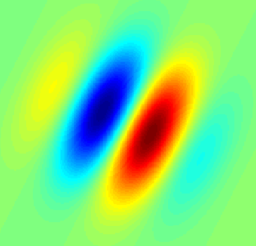

## The History of Convolutional Neural Networks
* first biological experiments in the 1950s
* 1959, David Hubel & Torsten Wiesel 
    * simple and complex cells used for pattern recognition
    * located in human visual cortex
    * **simple cell**: responds to edge and bars of particular orientations

    * **complex cell**: same as simple cell but edges / bars can be shifted around and still be recognized
    * Example for difference: 
        * simple cell might only respond to a horizontal bar at the bottom of an image
        * complex cell might respond to horizontal bars at the bottom, middle or top of an image
            * This property is called __**spatial invariance**__
* 1962, Hubel & Wiesel
    * complex cells achieve spatial invariance by _summing_ the output of several simple cells
    * those simple cells prefer the same orientation but use different __**receptive fields**__ (e.g. bottom, top, etc.)
* 1980s, Dr. Kunihiko Fukushima
    * inspired by Hubel & Wiesel
    * proposed _neocognitron_ model
    * model consists of _S-Cells_ and _C-Cells_ 
    * cells represent mathematical operations (not biological cells)
        * **S-Cells**
            * sit in first layer of the model
            * are connected to C-Cells
        * **C-Cells**
            * sit in second layer of the model
    * very basic concept (overall idea): 
        * capture the _simle-to-complex_ concept 
        * turn it into a computational model for viual pattern recognition
* 1990er, Yann LeCun 
    * inspiriert durch Fukushima
    * Paper: "Gradient-Based Learning Applied to Document Recognition" 
    * CNN Modell welches simple Eigenschaften zu komplexeren zusammenfasst 
    * CNN Modell kann zur Erkennung von handschriftlichen Buchstaben / Zahlen verwendet werden
    * LeCun trainierte das CNN mit der "MNiST databse of handwritten digits" 
        * MNIST ausgesprochen "EM-nisst" 
        * MNIST enthält Bilder von handgeschriebenen Ziffern welche mit den entsprechenden Bedeutungen versehen wurden
    * Training für CNN mittels MNIST
        * ein beispielhaftes Bild wird gegeben
        * CNN soll versuchen die Ziffer zu erkennen
        * Modell wird anhand der Korrektheit der Aussage entsprechend verändert
        * Heutige Modelle erzielen fast perfekte Korrektheit
    * **Durch diesen Vorstoß werden sämtliche Adressen auf Briefen heutzutage von Maschinen zugeordnet**
* 1990er bis 2000er: Technik stetig verbessert
* 2012 AlexNet
    * erreicht state-of-the-art Performanz beim Beschriften von Bildern der ImageNet Challenge
    * Alex Krizhevsky publiziert Paper zum Modell
        * Name: "ImageNet Classification with Deep Convolutional Neuronal Networks"
    * ImageNet öffentliche / freie verfügbare Datenbank Bildern und den entsprechenden Bedeutungen
        * ähnlich zu MNIST
        * fokussiert sich auf naturgemäße Bilder (z.B. Person, Möbel, etc.)
        * mit massivem Aufwand verbunden da Menschen jedes Bild einzeln mit Bezeichung versehen mussten
        * beinhaltet ca. 14 000 000 Bilder
* weitere frei verfügbare Datenbanken für Bilder 
    * ähntlich wie ImageNet
        * CIFAR-10
        * CIFAR-100
        * VisualGenome
    * zum Erkennen von Gesichtern
        * CelebA
    * zum Erkennen von medizinischen Bildern
        * chest x-ray
        * photos of skin lesions
        * histopathology slides
    * todo Webseite mit Liste von frei verfügbaren Datasets einfügen
* Viele Firmen entwickeln heutzutage interessante Projekte
    * Bsp.: "Seeing AI" - kann Umgebung für blinde Personen beschreiben

